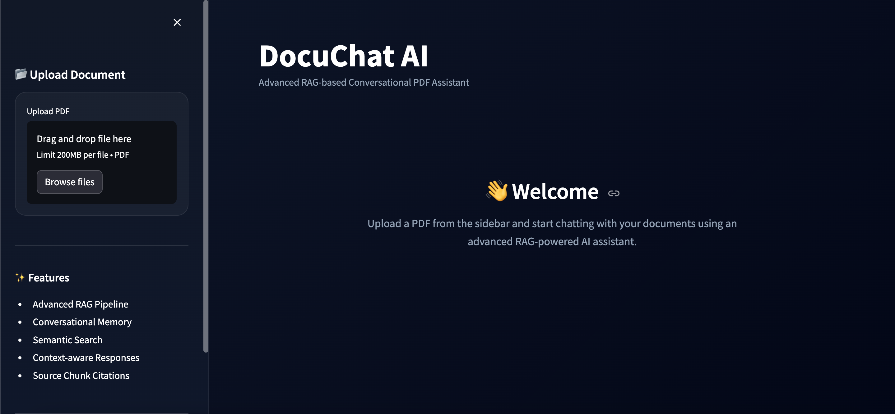
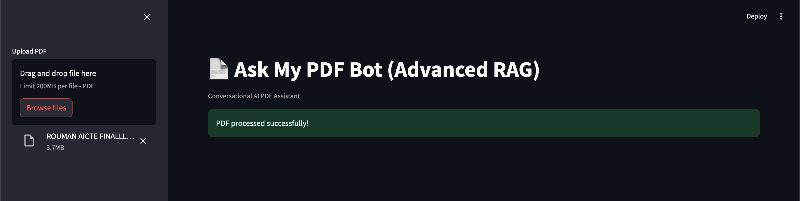
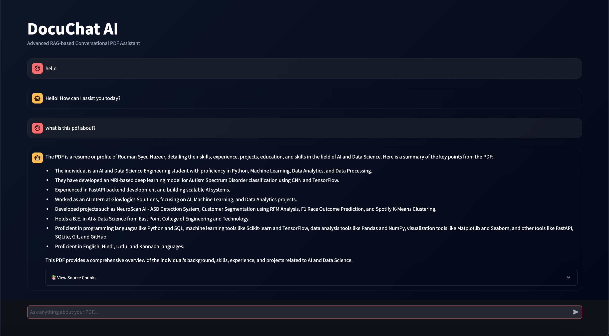
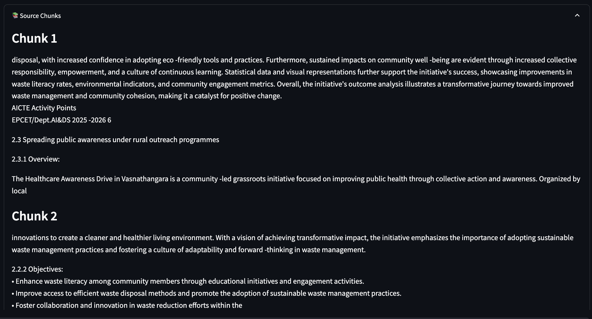

# Ask My PDF Bot (Advanced RAG System)

An advanced AI-powered PDF Question Answering system built using Python, LangChain, FAISS, Sentence Transformers, and Large Language Models.

The application enables users to upload PDF documents and interact with them conversationally using Retrieval-Augmented Generation (RAG). The system retrieves relevant contextual information from the uploaded document and generates intelligent, context-aware responses similar to ChatGPT.

---

## Features

- Upload and analyze PDF documents
- Conversational AI chatbot interface
- Advanced Retrieval-Augmented Generation (RAG)
- Semantic document search using FAISS
- Intelligent context-aware question answering
- Local embedding generation using Sentence Transformers
- Source chunk retrieval and citation display
- Conversational memory support
- Streamlit interactive web interface
- OpenRouter LLM integration
- Real-time PDF processing pipeline

---

## Technologies Used

- Python
- Streamlit
- LangChain
- FAISS Vector Database
- Sentence Transformers
- OpenRouter API
- OpenAI SDK
- PyPDF2
- dotenv
- HuggingFace Embeddings

---

## Project Structure

```text
Ask_My_PDF_Bot/
│
├── assets/
├── data/
├── images/
│
├── utils/
│   ├── chatbot.py
│   ├── chunking.py
│   ├── embeddings.py
│   ├── pdf_loader.py
│   └── retriever.py
│
├── vectorstore/
├── venv/
├── .env
├── .gitignore
├── app.py
├── README.md
└── requirements.txt
```

---

## System Workflow

### 1. PDF Upload

Users upload a PDF document through the Streamlit interface.

### 2. Text Extraction

The system extracts textual content from the uploaded PDF using PyPDF2.

### 3. Text Chunking

The extracted content is divided into smaller semantic chunks using LangChain text splitters.

### 4. Embedding Generation

Each chunk is converted into vector embeddings using Sentence Transformers.

### 5. Vector Database Storage

Generated embeddings are stored inside a FAISS vector database for efficient semantic retrieval.

### 6. Semantic Retrieval

When the user asks a question, the system retrieves the most relevant chunks from the vector database.

### 7. Response Generation

The retrieved context is passed to the Large Language Model through OpenRouter to generate intelligent and context-aware answers.

---

## Architecture Overview

```text
PDF Upload
     ↓
Text Extraction
     ↓
Chunking
     ↓
Embedding Generation
     ↓
FAISS Vector Storage
     ↓
Semantic Retrieval
     ↓
LLM Response Generation
     ↓
Conversational AI Answer
```

---

## Installation

### Clone the Repository

```bash
git clone https://github.com/yourusername/Ask_My_PDF_Bot.git
```

### Navigate to Project Directory

```bash
cd Ask_My_PDF_Bot
```

### Create Virtual Environment

```bash
python -m venv venv
```

### Activate Virtual Environment

#### macOS/Linux

```bash
source venv/bin/activate
```

#### Windows

```bash
venv\Scripts\activate
```

### Install Dependencies

```bash
pip install -r requirements.txt
```

---

## Environment Variables

Create a `.env` file in the root directory and add:

```env
OPENROUTER_API_KEY=your_api_key
```

---

## Run the Application

```bash
streamlit run app.py
```

---

## Example Questions

- What is this PDF about?
- Summarize the document
- Explain the key concepts discussed
- What are the important points mentioned?
- Explain this topic in simple terms

---

## Future Enhancements

- Multi-PDF support
- OCR support for scanned PDFs
- Persistent vector database storage
- Voice-based interaction
- Advanced citation-aware responses
- User authentication system
- Cloud deployment
- Export chat history
- PDF summarization dashboard

---

## Applications

- Research paper analysis
- Academic study assistant
- Resume and report analysis
- Legal document understanding
- Business document querying
- Technical documentation assistant
- Knowledge retrieval systems

---

# Screenshots

## Home Interface

<p align="center">
  
</p>

---

## PDF Upload Interface

<p align="center">
  
</p>

---

## Conversational Chat Interface

<p align="center">
  
</p>

---

## Retrieved Source Chunks

<p align="center">
  
</p>

---

## Author

### Rouman Syed Nazeer

AI/ML Developer | Python Developer | Generative AI Enthusiast
